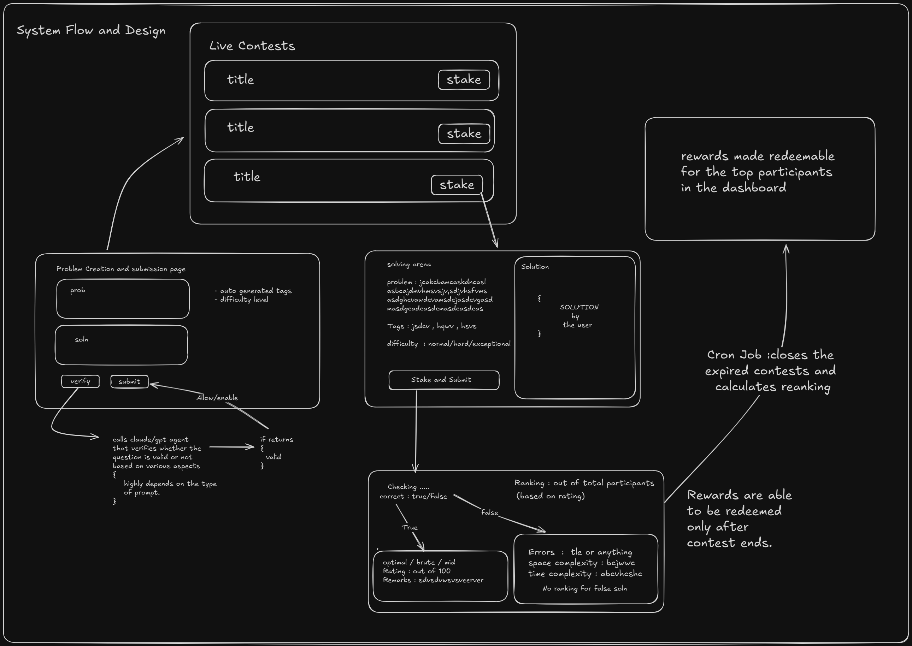
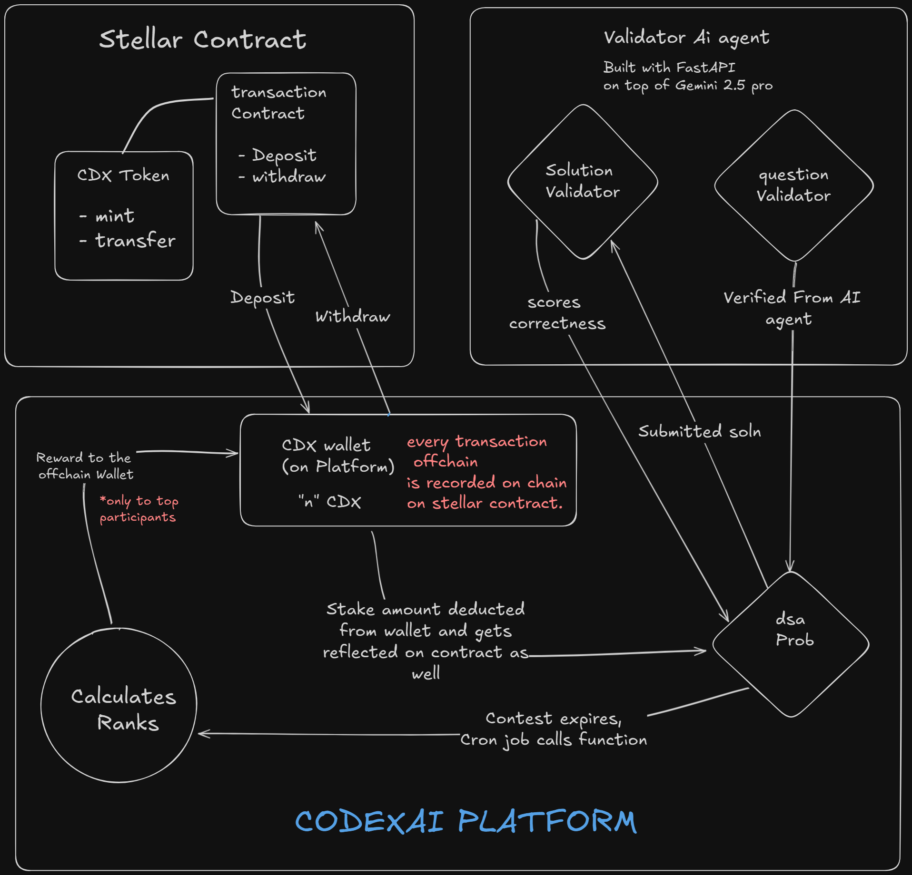

# 🧠 CodexAI

CodexAI is a decentralized, AI-enhanced competitive coding platform that rewards developers based on skill, performance, and fairness. Combining blockchain, smart contracts, and AI, CodexAI aims to transform how coding contests are conducted and incentivized.

---

## 🚀 Features

- **Decentralized Problem Solving**  
  Users create contests by staking CodexCoin (CDX), and participants also stake a portion to compete. Rewards are distributed based on well-defined criteria after 24 hours of contest end.

- **AI-Powered Evaluation**  
  Code is evaluated not only for correctness but also for efficiency, elegance, and time taken — all with the help of AI agents.

- **Trustless Reward System**  
  Funds are held in Stellar smart contracts and released after ranking finalization, ensuring transparency.

- **Secure & Fair Contests**  
  Anti-cheating mechanisms include:
  - Tab switch detection  
  - Time-limited code editors  
  - AI and user-based post-contest flagging

---

# Flow

# Technical Architecture 

## 🔗 Repositories

| Component                      | Repository                                                                 |
|-------------------------------|----------------------------------------------------------------------------|
| 🧠 Main Platform (Frontend)   | [codexAI](https://github.com/mohakchakraborty2004/codexAI)                |
| 🤖 Validator AI Agent         | [Validator-agent](https://github.com/mohakchakraborty2004/Validator-agent)|
| 💼 Vault Smart Contract       | [codexAI-Vault-Contract](https://github.com/mohakchakraborty2004/codexAI-Vault-Contract) |
| 🪙 CodexCoin (CDX Token)      | [codexcoin](https://github.com/mohakchakraborty2004/codexcoin)            |

---

## 📈 Why CodexAI Will Boom

With AI evolving to deeply analyze code — beyond syntax and correctness — CodexAI offers a future-proof system that:
- Understands code intent, complexity, and originality
- Uses models to detect plagiarism with context
- Can scale code reviews autonomously

As AI becomes more powerful, decentralized platforms like CodexAI will lead the way in merit-based, trustless coding evaluations.

---

## 🛠 Tech Stack

### 🔧 Frameworks
- [Next.js](https://nextjs.org/)
- [Stellar CLI](https://docs.stellar.org/)
- [Soroban SDK (Smart Contracts)](https://soroban.stellar.org/)

### 🧑‍💻 Languages
- TypeScript (Frontend & Agent)
- Rust (Smart Contracts)

### ☁️ Deployment
- **Smart Contracts** → Stellar Blockchain  
- **Agent** → [Render](https://render.com/)  
- **Frontend** → [Vercel](https://vercel.com/)

---

## 🧪 Future Improvements

1. **Blind Problem Pools**  
   Participants will stake and receive a randomly assigned question (based on tags only), increasing fairness and challenge.

2. **AI Practice Arena**  
   - AI-generated personalized questions  
   - Difficulty scaling based on history  
   - Feedback on logic, code quality, and structure  
   - AI-guided walkthroughs and code debugging

3. **Enhanced Anti-Cheating Security**  
   - Code editor with time limits  
   - AI-powered behavioral flagging  
   - Community moderation post-contest

---

## 📜 Problem Statement

> Developers solve challenging problems but aren't rewarded or recognized beyond platform scores.  
CodexAI fixes this by offering **on-chain reputation** and **crypto-based rewards** for verified, fair skill demonstration.

---

## 📄 License

This project is licensed under the MIT License. See [`LICENSE`](./LICENSE) for details.

---

## 🤝 Contributing

We welcome contributions! Open a pull request, report issues, or suggest ideas in the [Issues](https://github.com/mohakchakraborty2004/codexAI/issues) section.

---

